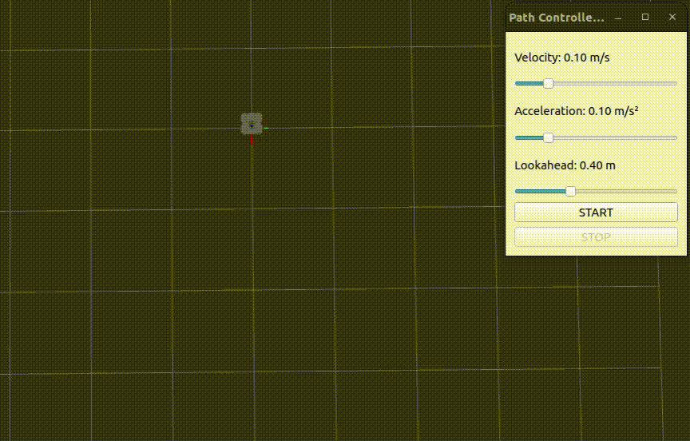
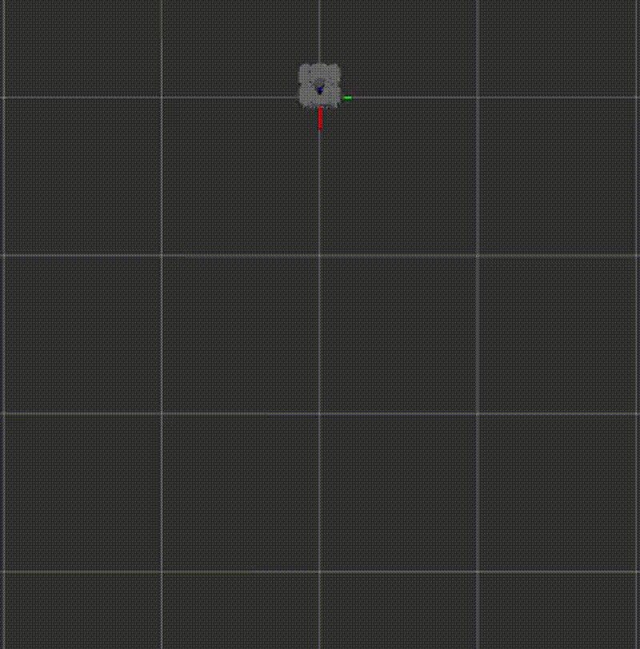

# Controller Module

## Overview

This module implements a **Pure Pursuit path-following controller** for a mobile robot in **ROS 2 Humble**.  
Once a smooth spline path is generated from user-selected waypoints, the controller tracks the path using a geometric lookahead-based strategy.

The robot motion is **explicitly triggered by the user** (via a terminal key press), allowing the lookahead point and path geometry to be inspected in RViz **before execution**.

---

## Controller Description

- **Path input**: `nav_msgs/Path` generated from spline interpolation  
- **Control method**: Pure Pursuit (curvature-based tracking)  
- **Lookahead point**:
  - Selected along the path using **arc-length parameterization**
  - Ensures smooth, forward-only tracking
- **Motion profile**:
  - Supports constant velocity
  - Extendable to trapezoidal (constant acceleration) profiles

---

## User Interaction

- Waypoints can be selected incrementally (e.g., via RViz)
- Robot motion starts only after pressing:
  - **`w`** → start following the path  
  - **`s`** → stop the robot  

---

## Demo

### Path Following Demonstration

<<<<<<< HEAD

---

### 2. Path Generation without Map

Path generation in an empty environment using only the odometry frame.

📹 **Video Demo:** *(add link here)*

---

### 3. Path Planning with Obstacle Avoidance

Path generation in the presence of obstacles, demonstrating obstacle-aware planning.

📹 **Video Demo:** *(add link here)*

---

## Visualization

- **Waypoints:** red markers  
- **Planned path:** continuous line strip  
- **Robot model and frames:** displayed via TF in RViz  

---

## Notes

- This module focuses on **path planning**, not low-level control.
- Time parameterization is designed for downstream controller usage.
- The architecture supports future extensions such as:
  - Online replanning
  - Advanced obstacle handling
  - Controller integration (Pure Pursuit, MPC, etc.)

---
=======
>>>>>>> controller
