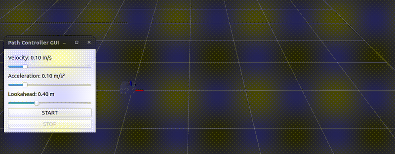

# Differential Robot Navigation 

## Overview

This project demonstrates **differential-drive robot navigation** in **ROS 2 Humble** under scenarios **with and without map availability**.  
The system integrates **interactive path planning** with a **Pure Pursuit controller** to follow smooth trajectories generated from user-defined waypoints.

The emphasis is on **geometric path tracking**, controller behavior visualization, and user-controlled execution.

## Baseline Scenario: No Map, No Obstacles

In the simplest setup, the environment contains **no map and no obstacles**.

- Waypoints are selected interactively (e.g., via RViz)
- A smooth spline path is generated through the waypoints
- The robot follows the path using a **Pure Pursuit controller**
- Motion is explicitly triggered by the user

🎥 **Demo: Path Following without Map or Constraints** 

## Controller Insights

- **Lookahead distance** controls tracking behavior: larger values produce smoother but less accurate paths, while smaller values improve accuracy at the cost of higher curvature and oscillations.

- **Velocity** directly affects stability: higher speeds amplify tracking error, whereas lower speeds improve cornering and path adherence.

- **Pure Pursuit** is a lightweight geometric controller well suited for differential-drive robots, performing robustly even without map information.
